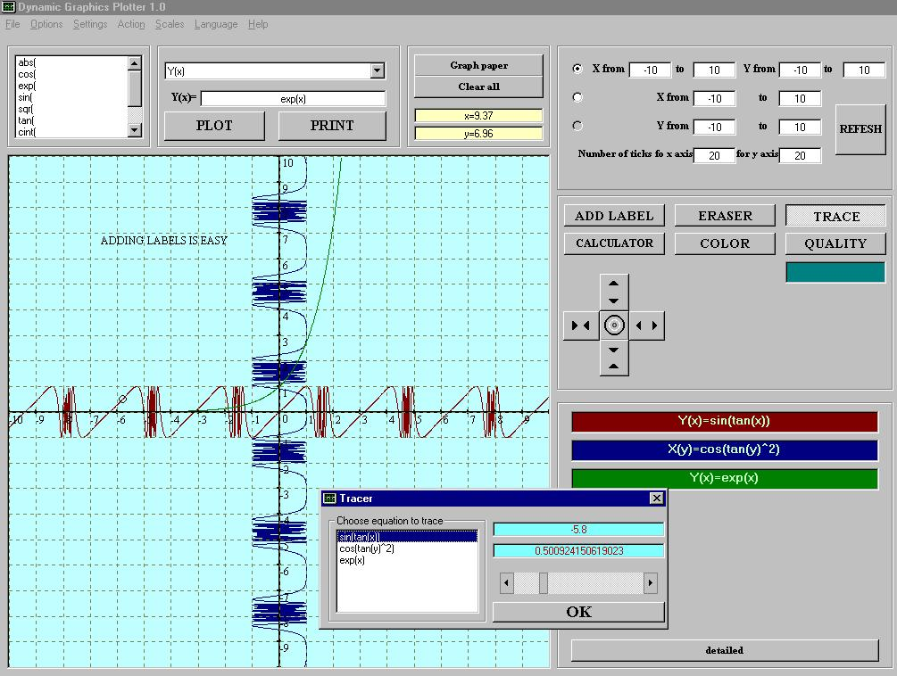

<div align="center">

## Dynamic Graph Plotter 2


</div>

### Description

This is a second,more advanced virsion of my DGP. The programs main purpose is to plot functions. It also supports many additional functions like add labels,eraser of labels, calculator,extending and squeezing axis, zoom box,grid on screen, choosing color, trace equation (updated),Detailed history!(check program) save picture, print picture.You can edit a single equation(New!) From virsion 2.1.0 DGP speaks English, French(NEW) and Dutch(NEW!).A lot of minor bugs are now fixed.All code is fully commented. I would like to thank Ralph Vloemans for his help with languages. Thank you.Please dont forget- it takes days,weeks,months to write a code and make it available to you and it only takes few seconds to rate and leave comments - which is much wormer response than any prize for most developers on PSC.
 
### More Info
 
function

This is a second,more advanced virsion of my DGP. The programs main purpose is to plot functions. It also supports many additional functions like add labels,eraser of labels, calculator,extending and squeezing axis, zoom box,grid on screen, choosing color, trace equation (updated),Detailed history!(check program) save picture, print picture.You can edit a single equation(New!) From virsion 1.1.0 DGP speaks English, French(NEW) and Dutch(NEW!).A lot of minor bugs are now fixed.All code is fully commented. I would like to thank Ralph Vloemans for his help with languages. Thank you.

plot of function


<span>             |<span>
---                |---
**Submitted On**   |2001-03-16 05:24:22
**By**             |[Cyberjet](https://github.com/Planet-Source-Code/PSCIndex/blob/master/ByAuthor/cyberjet.md)
**Level**          |Intermediate
**User Rating**    |5.0 (40 globes from 8 users)
**Compatibility**  |VB 6\.0
**Category**       |[Graphics](https://github.com/Planet-Source-Code/PSCIndex/blob/master/ByCategory/graphics__1-46.md)
**World**          |[Visual Basic](https://github.com/Planet-Source-Code/PSCIndex/blob/master/ByWorld/visual-basic.md)
**Archive File**   |[CODE\_UPLOAD170853152001\.zip](https://github.com/Planet-Source-Code/cyberjet-dynamic-graph-plotter-2__1-21640/archive/master.zip)

### API Declarations

```
kernel32
user32
```


